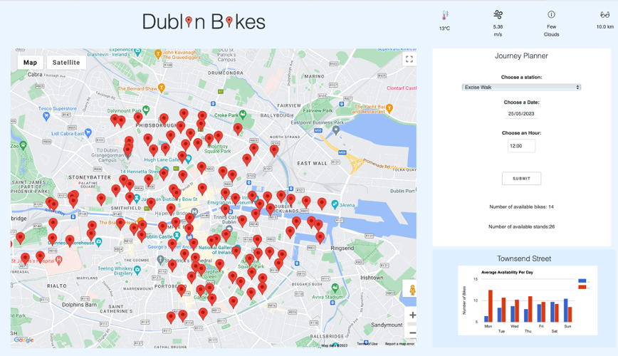
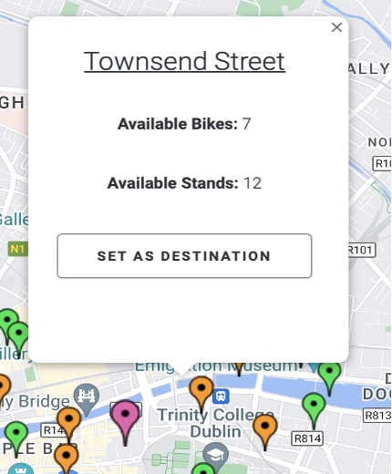
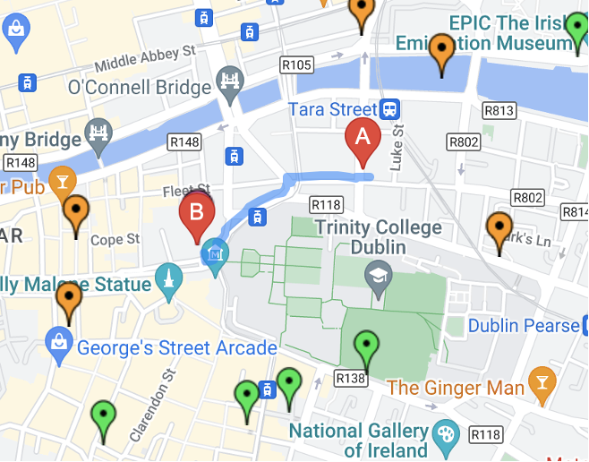

# Dublin_Bikes

A Flask-based journey planner that provides:

- **Availability based on Historical Data**: Displays all DublinBikes stations in Dublin.
- **Location-based Search**: Users can input a location to discover the nearest station with either available bikes or stands.
- **Predictive Features**: Enter a time and date for future travel to see predicted availability, utilizing a model trained on both bike availability and weather data.
  
Data for this project is sourced from [JCDecaux](https://developer.jcdecaux.com/#/opendata/vls?page=getstarted).

## Project

  

## Availability

    <!-- Adjusted width here -->
  

